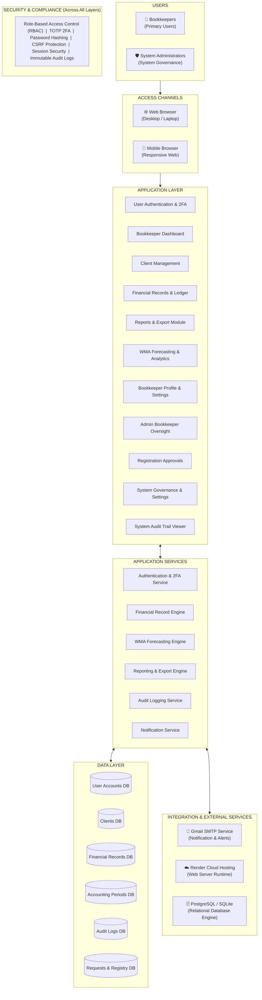

# SafeBooks — Logical View Architectural Diagram

This document contains the **exact, essential contents** for your SafeBooks Logical View Diagram, structured to match your reference diagram (**ABC University Integrated Student Clearance System**), followed by a **ready-to-use prompt** to generate the diagram.

---

## 1. Diagram Title & Header

* **Project Title:** `SAFEBOOKS: WEB-BASED FINANCIAL RECORD-KEEPING AND FORECASTING SYSTEM`
* **Diagram Subtitle:** `LOGICAL VIEW ARCHITECTURAL DIAGRAM`

---

## 2. Diagram Contents (Organized by Layer)

### A. USERS (Left Column)
Actors who interact directly with SafeBooks:
1. **Bookkeepers (Primary User)** — Enters financial records, manages clients, generates financial reports, and views WMA revenue forecasts.
2. **System Administrators** — Reviews registrations, oversees bookkeeper accounts, configures system policies, and monitors audit logs.

---

### B. ACCESS CHANNELS (Second Column)
Entry points to the system:
1. **Desktop Web Browser** — Primary workstation interface (Chrome, Edge, Firefox).
2. **Mobile / Tablet Browser** — Responsive web interface for on-the-go access.

---

### C. APPLICATION LAYER (Center Main Box)
The functional modules that deliver business features:

| Module Name | Key Function |
|---|---|
| **User Authentication & 2FA** | Login, signup, password validation, and TOTP 2FA verification |
| **Bookkeeper Dashboard** | Overview cards, deadline alerts, summary stats, and quick actions |
| **Client Profile Management** | Add, update, view, and organize client business records |
| **Financial Records & Ledger** | Entry and tracking of income, expenses, transaction lines, and periods |
| **Reports & Export Module** | Generates balance sheets, income statements, and print/export layouts |
| **WMA Forecasting & Analytics** | Weighted Moving Average revenue predictions, charts, and financial trends |
| **Bookkeeper Profile & Settings** | Account details, password updates, 2FA setup, and deactivation requests |
| **Bookkeeper Oversight Module** | Admin directory to monitor, search, and manage bookkeeper accounts |
| **Registration & Approval Module** | Admin queue to review, approve, or reject pending bookkeeper signups |
| **System Governance & Settings** | Admin controls for security rules, session timeouts, and maintenance |
| **Audit Log Viewer** | Detailed, searchable activity log for both user and admin actions |

---

### D. APPLICATION SERVICES (Horizontal Band Below Application Layer)
The core backend business logic powering the modules:

* **Authentication & Session Service** — Manages credentials, tokens, session cookies, and 2FA TOTP keys.
* **Financial Record Engine** — Validates debit/credit entries, calculates balances, and links period records.
* **Forecasting Engine (WMA)** — Runs Weighted Moving Average formulas across historical client figures.
* **Reporting Engine** — Aggregates financial data for summaries, printable views, and CSV exports.
* **Audit Logging Service** — Automatically records all user actions with timestamps and IP addresses.
* **Email Notification Service** — Formats and triggers transactional emails (approval alerts, security notices).

---

### E. DATA LAYER (Horizontal Band Below Services)
Logical data entities persisted in the database:

| Logical Database Entity | Content Stored |
|---|---|
| **User Accounts DB** | `BookkeepersAccount`, `AdminAccount` (credentials, profile info, 2FA secrets) |
| **Clients DB** | `Client` (business names, contacts, addresses, status) |
| **Financial Records DB** | `FinancialRecord`, `TransactionDetail` (amounts, categories, dates) |
| **Accounting Periods DB** | `Period`, `WorkspaceDefaults` (active financial cycles, tax/currency rules) |
| **Audit Logs DB** | `BookkeeperAuditLog`, `AdminAuditLog` (immutable action histories) |
| **Requests & System DB** | `BookkeeperDeactivationRequest`, `TableRegistry` (approval states, system registry) |

---

### F. INTEGRATION & EXTERNAL SERVICES (Right Column)
External tools and infrastructure connected to SafeBooks:

* **Gmail SMTP Service** — Delivers email verification codes, admin approval alerts, and password resets.
* **Cloud Hosting Platform (Render)** — Hosts the Django application runtime and handles HTTPS traffic.
* **Relational Database Engine** — SQLite (local development) / PostgreSQL (cloud production).
* **Browser Print & PDF Engine** — Client-side print formatting for financial reports.

---

### G. SECURITY & COMPLIANCE (Full-Width Bottom Bar)
Security controls active across all layers:
> **Role-Based Access Control (RBAC) | TOTP Two-Factor Authentication | Password Hashing (Argon2/PBKDF2) | CSRF Protection | Session Inactivity Timeout | Immutable Audit Trails**

---

### H. LEGEND (Bottom Corner)
* 🟦 **Presentation / Access** (Light Blue)
* 🟩 **Application Layer** (Teal / Soft Blue)
* 🟨 **Application Services** (Warm Gold / Light Orange)
* 🟢 **Data Layer** (Mint / Soft Green)
* 🟪 **Integration / External Services** (Lavender / Soft Purple)
* 🛡️ **Security & Compliance** (Navy / Slate Blue)

---

## 3. Mermaid Architecture Code (Ready to Copy/Paste)

You can paste this code directly into [Mermaid Live Editor](https://mermaid.live) or Draw.io (`Arrange` > `Insert` > `Advanced` > `Mermaid`) to view or export the diagram immediately:



---

## 4. Master Prompt for Creating the Diagram

Copy and paste the prompt below into an AI tool (such as **ChatGPT Plus / DALL-E 3**, **Midjourney**, or a diagram design tool like **Eraser.io**, **Napkin.ai**, or **Draw.io AI**):

```text
Create a high-resolution, professional software architecture diagram titled:
"SAFEBOOKS - WEB-BASED FINANCIAL RECORD-KEEPING AND FORECASTING SYSTEM"
Subtitle: "LOGICAL VIEW ARCHITECTURAL DIAGRAM"

Style and Layout Guidelines:
- Clean enterprise software architecture diagram on a crisp white background.
- Follow a modern multi-layer layout with rounded rectangular containers, subtle drop shadows, clean borders, and clear typography (Inter or Roboto font style).
- Arrow connectors: All connector arrows should be **dashed / striped lines** (not thick solid lines):
  - A single right-pointing dashed arrow (---▶) from USERS to ACCESS CHANNELS.
  - Bidirectional dashed arrows (◀---▶) between ACCESS CHANNELS and APPLICATION LAYER, APPLICATION LAYER and APPLICATION SERVICES, APPLICATION SERVICES and DATA LAYER, and APPLICATION LAYER and INTEGRATION SERVICES.

Diagram Components to Include:

1. Top Header:
   - Centered Title: "SAFEBOOKS – WEB-BASED FINANCIAL RECORD-KEEPING AND FORECASTING SYSTEM"
   - Centered Subtitle: "LOGICAL VIEW ARCHITECTURAL DIAGRAM"

2. Left Column - "USERS" (Container with person icons):
   - Bookkeepers (Primary Users)
   - System Administrators (Administrative Users)

3. Second Column - "ACCESS CHANNELS" (Container with device icons):
   - Web Browser (Desktop / Laptop)
   - Mobile Browser (Responsive Web App)

4. Center Main Box - "APPLICATION LAYER" (Clean 3-column grid of modular feature cards with subtle icons):
   - User Authentication & 2FA Module
   - Bookkeeper Dashboard & Summary
   - Client Profile Management
   - Financial Records & Ledger Module
   - Reports & Statement Export Module
   - WMA Forecasting & Analytics Engine
   - Bookkeeper Profile & Settings
   - Admin Bookkeeper Oversight Module
   - Registration & Account Approvals
   - System Governance & Settings
   - System Audit Trail Viewer

5. Middle Horizontal Container - "APPLICATION SERVICES" (Directly below Application Layer, containing service block cards):
   - Authentication & Session Service
   - Financial Record Engine
   - Forecasting Engine (Weighted Moving Average)
   - Reporting & Export Engine
   - Audit Logging Service
   - Email Notification Service

6. Bottom Horizontal Container - "DATA LAYER" (Directly below Application Services, containing cylinder database icons):
   - User Accounts DB (Bookkeeper & Admin Accounts)
   - Clients DB (Client Profiles & Contact Details)
   - Financial Records DB (Transactions & Line Entries)
   - Accounting Periods DB (Periods & Workspace Defaults)
   - Audit Logs DB (Bookkeeper & Admin Action Trails)
   - Requests & System DB (Deactivation Requests & Registry)

7. Right Column - "INTEGRATION & EXTERNAL SERVICES":
   - Gmail SMTP Service (Use a simple monochrome purple mail/envelope icon, NOT the multi-colored Google logo; Email Notifications & Verification)
   - Render Cloud Platform (Web Application Hosting)
   - PostgreSQL / SQLite (Database Engine)
   - Document & Print Engine (Report Generation)

8. Full-Width Bottom Bar - "SECURITY & COMPLIANCE (Across All Layers)":
   - Centered text inside a dark blue bar:
     "Role-Based Access Control (RBAC)  |  TOTP Two-Factor Authentication  |  Password Hashing  |  CSRF Protection  |  Session Management  |  Audit & Activity Monitoring"

9. Legend (Bottom-Left Corner):
   - Small colored boxes defining: Presentation/Access, Application, Services, Data, Integration, Security.

Color Palette:
- Soft Slate Blue / Navy for Headers and Borders
- Soft Blue/Teal for Application Layer Cards
- Warm Light Orange/Gold for Application Services
- Soft Mint Green for Data Layer Cylinders
- Lavender/Purple for Integration & External Services
- Dark Blue for the Security & Compliance Bar

Ensure all text is completely legible, spelled correctly, and formatted with crisp vector-like visual precision.
```

---

## 5. Revision & Edit Prompt (For ChatGPT / DALL-E Image Editor)

Copy and paste this prompt to update the generated image:

```text
Please modify the generated diagram with the following three corrections:

1. Dashed / Striped Arrow Style:
   - Change all arrows from solid thick lines to clean dashed lines (striped / dotted connector arrows like in UML architecture diagrams).
   - The connector between USERS and ACCESS CHANNELS must be a single right-pointing dashed arrow (---▶), showing users entering the system.
   - All other connectors between layers should be bidirectional dashed arrows (◀---▶).

2. Gmail SMTP Icon:
   - Replace the multi-colored Google "M" logo under "INTEGRATION & EXTERNAL SERVICES" with a simple, solid monochrome mail/envelope icon that matches the purple theme of that column. Do not use the multi-colored Google brand logo.

Keep all other text, cards, colors, layout, and database cylinders exactly as they are.
```

