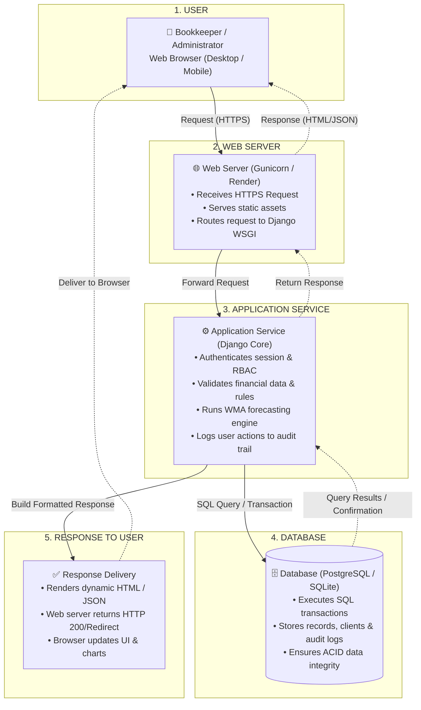

# SafeBooks — Process / Runtime View Architectural Diagram

This document provides the **exact contents, structure, and AI generation prompt** for the **SafeBooks Process / Runtime View Diagram**, modeled directly after your professor's reference example (**Integrated Student Clearance System — Process or Runtime View**).

---

## 1. Diagram Title & Header

- **Top Header:** `PROCESS / RUNTIME VIEW`
- **System Title:** `SAFEBOOKS: A WEB-BASED FINANCIAL RECORDS AND COMPLIANCE MONITORING SYSTEM WITH FORECASTING ANALYTICS`
- **Left Callout Banner:** `Process or Runtime View`

---

## 2. Complete Diagram Contents (3-Column Layout)

The diagram follows the exact 3-column layout from your professor's reference:

- **Left Column:** Numbered sequence steps (1 to 5) explaining the lifecycle.
- **Center Column:** Stacked architectural processing containers with directional arrows.
- **Right Column:** Contextual summary cards linked by dashed guide lines.

---

### Step 1: User Request

- **Left Numbered Step (1):**
  - Title: `User Request`
  - Text: `User (Bookkeeper or Administrator) initiates an action such as entering transactions, viewing WMA forecasts, or approving accounts.`
- **Center Container (`USER`):**
  - Color: Soft Light Blue
  - Icon: User silhouette + Desktop / Mobile device
  - Sub-label: `Web Browser (Desktop / Mobile App)`
  - Outgoing connector: Solid downward arrow labeled `Request`
  - Incoming connector: Dashed upward arrow labeled `Response`
- **Right Summary Card:**
  - Icon: User group
  - Text: `User initiates a financial operation, report request, or administrative task through the web browser.`

---

### Step 2: Web Server

- **Left Numbered Step (2):**
  - Title: `Web Server`
  - Text: `Web server terminates SSL/HTTPS, serves static assets, and securely routes dynamic requests to the Django WSGI application.`
- **Center Container (`WEB SERVER`):**
  - Color: Soft Light Green
  - Icon: Server stack + Globe / Cloud
  - Bullet Points:
    - Receives incoming HTTPS Request & enforces SSL
    - Serves static assets (CSS stylesheets, JS modules, images)
    - Forwards dynamic request to Django Application Service (WSGI)
  - Outgoing connector: Solid downward arrow labeled `Request`
  - Incoming connector: Dashed upward arrow labeled `Response`
- **Right Summary Card:**
  - Icon: Network globe
  - Text: `Web server securely accepts traffic, handles static files, and routes dynamic requests to the application layer.`

---

### Step 3: Application Service

- **Left Numbered Step (3):**
  - Title: `Application Service`
  - Text: `Django application verifies session authentication, checks RBAC permissions, runs business logic & WMA formulas, and queries the database.`
- **Center Container (`APPLICATION SERVICE`):**
  - Color: Soft Lavender / Purple
  - Icon: Interlocking gears
  - Bullet Points:
    - Authenticates session, validates CSRF token & enforces RBAC
    - Validates financial inputs & business rules
    - Executes core logic (WMA forecasting, report calculations)
    - Prepares queries & records actions via Audit Logging Service
  - Outgoing connector: Solid downward arrow labeled `Request`
  - Incoming connector: Dashed upward arrow labeled `Result`
- **Right Summary Card:**
  - Icon: Gear mechanism
  - Text: `Application service executes business logic, applies forecasting models, and performs database operations.`

---

### Step 4: Database

- **Left Numbered Step (4):**
  - Title: `Database`
  - Text: `Relational database executes queries or ACID transactions, updates financial ledgers or audit logs, and returns data.`
- **Center Container (`DATABASE`):**
  - Color: Warm Light Orange / Gold
  - Icon: Database cylinder
  - Bullet Points:
    - Executes ACID-compliant SQL queries & transactions
    - Stores and retrieves accounts, clients, ledgers, and audit logs
    - Enforces relational constraints and ensures data integrity
  - Outgoing connector: Solid downward arrow labeled `Response`
  - Incoming connector: Dashed upward arrow labeled `Result`
- **Right Summary Card:**
  - Icon: Database cylinder
  - Text: `Database persists or queries financial records, ensuring data integrity, and returns results.`

---

### Step 5: Response to User

- **Left Numbered Step (5):**
  - Title: `Response to User`
  - Text: `Application service constructs the response (HTML page or JSON data), and web server transmits it back to the browser.`
- **Center Container (`RESPONSE TO USER`):**
  - Color: Soft Teal / Aqua
  - Icon: Checkmark circle
  - Bullet Points:
    - Application service renders template with dynamic context / JSON
    - Web server returns HTTP response (200 OK / Redirect)
    - User browser updates view, renders financial charts, or confirms action
- **Right Summary Card:**
  - Icon: Checkmark badge
  - Text: `Formatted response is delivered back to the user's browser, updating the interface in real time.`

---

### Legend (Bottom Right)

- ──▶ **Request Flow (Synchronous):** Solid arrow indicating the downstream execution flow.
- - - -▶ **Response Flow (Synchronous):** Dashed arrow indicating the upstream data response flow.

---

## 3. Mermaid Flowchart Code (Ready to Copy/Paste)

You can paste this directly into [Mermaid Live Editor](https://mermaid.live) or Draw.io to view the interactive flow:



---

## 4. Master Prompt for Creating the Diagram (For ChatGPT / DALL-E)

Copy and paste this prompt to generate your diagram:

```text
Create a high-resolution, professional enterprise software architecture diagram titled:
"PROCESS / RUNTIME VIEW"
Subtitle: "SAFEBOOKS: A WEB-BASED FINANCIAL RECORDS AND COMPLIANCE MONITORING SYSTEM WITH FORECASTING ANALYTICS"

Layout and Visual Style Guidelines:
- Clean 3-column architecture layout on a solid crisp white background.
- Left edge: A prominent dark navy blue block badge labeled "Process or Runtime View".
- Modern flat card aesthetic with clean rounded corners, subtle shadows, and crisp sans-serif typography.
- Professional, perfectly aligned vertical flow with balanced spacing.

Diagram Structure:

1. Top Header:
   - Centered Main Title: "PROCESS / RUNTIME VIEW"
   - Centered Subtitle: "SAFEBOOKS: A WEB-BASED FINANCIAL RECORDS AND COMPLIANCE MONITORING SYSTEM WITH FORECASTING ANALYTICS"

2. Left Column - "Step Numbers & Descriptions" (Vertical numbered circles connected by subtle vertical dashed lines):
   - Step 1 (Dark Blue Circle "1"): "User Request" - User initiates an action (recording transactions, viewing WMA forecasts, or approving accounts).
   - Step 2 (Green Circle "2"): "Web Server" - Web server receives the request, terminates SSL, serves static content, and routes to application service.
   - Step 3 (Purple Circle "3"): "Application Service" - Django service validates input, enforces RBAC, executes business logic & WMA algorithms, and queries database.
   - Step 4 (Orange Circle "4"): "Database" - Relational database executes queries/transactions, ensures data integrity, and returns data.
   - Step 5 (Teal Circle "5"): "Response to User" - Application builds response, web server delivers HTTP payload, and user interface updates.

3. Center Column - "Runtime Architectural Components" (Stacked rectangular cards connected by vertical arrows):
   - Card 1 ("USER", Soft Light Blue):
     - Icon: User silhouette + Desktop / Mobile monitor
     - Label: "Web Browser / Mobile App"
     - Downward arrow: Solid arrow labeled "Request"
     - Upward arrow: Dashed arrow labeled "Response"
   - Card 2 ("WEB SERVER", Soft Light Green):
     - Icon: Server stack + Globe
     - Bullets:
       • Receives HTTP/HTTPS Request
       • Handles static content
       • Forwards request to application service
     - Downward arrow: Solid arrow labeled "Request"
     - Upward arrow: Dashed arrow labeled "Response"
   - Card 3 ("APPLICATION SERVICE", Soft Lavender/Purple):
     - Icon: Two interlocking gears
     - Bullets:
       • Validates request & enforces RBAC
       • Applies financial business logic
       • Computes WMA forecasting algorithms
       • Reads/Writes data to/from database
     - Downward arrow: Solid arrow labeled "Request"
     - Upward arrow: Dashed arrow labeled "Result"
   - Card 4 ("DATABASE", Soft Warm Gold/Orange):
     - Icon: 3D Database cylinder
     - Bullets:
       • Executes queries / transactions
       • Stores and retrieves data
       • Ensures data integrity
     - Downward arrow: Solid arrow labeled "Response"
     - Upward arrow: Dashed arrow labeled "Result"
   - Card 5 ("RESPONSE TO USER", Soft Teal/Aqua):
     - Icon: Circular green checkmark
     - Bullets:
       • Application service formats the response
       • Web server returns response (HTML/JSON)
       • User receives the response & UI updates

4. Right Column - "Summary Cards" (Horizontal cards connected to each center component with a thin dashed horizontal line):
   - Top Card (User group icon): "User sends a request to record transactions, view forecasts, or manage accounts."
   - Second Card (Globe icon): "Web server handles incoming HTTPS requests securely and routes them to Django."
   - Third Card (Gears icon): "Application service validates data, runs WMA forecasting, and coordinates database operations."
   - Fourth Card (Database icon): "Database executes transactions and returns requested financial records or confirmation."
   - Fifth Card (Checkmark icon): "Response is sent back to the user via the web server, updating the interface."

5. Bottom-Right Corner - "LEGEND":
   - Boxed legend containing:
     - Solid arrow (──▶): "Request Flow (Synchronous)"
     - Dashed arrow (- - -▶): "Response Flow (Synchronous)"

Color Palette:
- Dark Navy for Title Badges and Step 1
- Soft Blue (#EBF3FA) for User container
- Soft Green (#EBF7EE) for Web Server container
- Soft Lavender/Purple (#F3EDF9) for Application Service container
- Warm Light Gold/Orange (#FEF7E7) for Database container
- Soft Teal/Mint (#E6F7F5) for Response container

Ensure all text is razor-sharp, completely legible, correctly spelled, with no blurry or truncated words.
```
