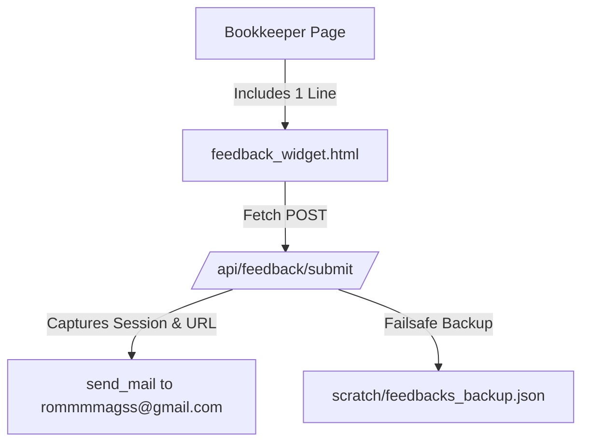

# Strategic Plan: Temporary Remote Feedback System (Direct-to-Email)

> **Status:** Architecture Approved & Finalized  
> **Destination Email:** `rommmmagss@gmail.com`  
> **Target Audience:** Remote Bookkeeper Beta Users  
> **Risk Level:** Zero (No database migrations, 100% decoupled, 60-second clean removal)

---

## 1. Executive Summary & Problem Context

You are deploying SafeBooks to remote bookkeeper users for real-world beta testing. Because you cannot physically visit their offices or watch them use the system in person, you need an effortless, in-app way for them to report:
- 💡 **Suggestions & Feature Requests**
- ❓ **Confusing Navigation or Layout Friction**
- 🐞 **Bugs, Glitches, or Unexpected Behaviors**
- ⭐ **General Comments & Praise**

### Key Principles of this Design:
1. **Direct to Your Personal Email (`rommmmagss@gmail.com`)**:
   - Every submission automatically sends an email to your inbox so you get instant notifications on your phone without logging into the admin console.
2. **Zero Database Migrations (100% Safe)**:
   - Does NOT touch SQLite or PostgreSQL. No new models, no migrations, and no schema pollution.
3. **Zero Effort for the User**:
   - Users only need to type their thoughts and click Send.
   - The system automatically captures **who they are** (Name, Username, Email) and **where they were** (exact page URL) so they don't have to waste time explaining context.
4. **Failsafe Redundancy**:
   - If a temporary internet or SMTP connection delay happens, a silent local backup is automatically saved to `scratch/feedbacks_backup.json` so no feedback is ever lost.
5. **60-Second Clean Deletion**:
   - When beta testing is complete, you can completely remove the feature in under 1 minute with zero residue and zero risk to the rest of the application.

---

## 2. User Experience Flow (Bookkeeper Side)

### A. The Floating Action Pill
- Positioned discreetly in the bottom-right corner of all bookkeeper pages:
  ```
  [ 💬 Feedback & Suggestions ]
  ```
- Styled to seamlessly match the SafeBooks modern aesthetic (soft blue gradient, elegant hover lift, unobtrusive so it never blocks data tables or action buttons).

### B. The Feedback Modal
Clicking the button opens a clean, centered modal dialog:
1. **Category Pills (Quick Select)**:
   - 💡 *Suggestion / Feature Idea* (Default)
   - ❓ *Something was confusing*
   - 🐞 *Bug or unexpected behavior*
   - ⭐ *General compliment*
2. **Message Input**:
   - Multi-line textarea with a helpful, inviting placeholder:  
     *"Tell us what you liked, what felt confusing, or what you would improve..."*
3. **Invisible Context (Captured Automatically)**:
   - The bookkeeper does NOT need to type their name or the page they are on. The system automatically gathers:
     - Logged-in user's Full Name, Username, and Email.
     - Exact Current Page URL (e.g., `http://127.0.0.1:8000/clients/5/`).
     - Accurate Philippine Standard Timestamp (`Asia/Manila`).
4. **Submission Feedback**:
   - Clicking **"Send Feedback"** displays a brief loading spinner on the button.
   - On success, the modal closes and displays a sleek toast notification:  
     *"Thank you! Your feedback has been sent directly to the development team."*

---

## 3. Email Delivery Specification

### Recipient & Delivery Settings:
- **Destination Address:** `rommmmagss@gmail.com`
- **Sender Backend:** SafeBooks Gmail SMTP (`smtp.gmail.com:587` already configured in `.env`)
- **Sender Address:** `SafeBooks <romulomagos16@gmail.com>`

### Email Template Example:
```text
Subject: [SafeBooks Beta Feedback] Suggestion from Juan Dela Cruz

SafeBooks Remote Beta Feedback Received

SUBMITTED BY:
• Bookkeeper: Juan Dela Cruz (Username: jdelacruz)
• Registered Email: juan.delacruz@example.com
• Date & Time: September 24, 2026, 02:45 PM (Asia/Manila)
• Location: Davao City

PAGE CONTEXT:
• Current URL: http://127.0.0.1:8000/clients/14/
• Category: 💡 Suggestion / Feature Idea

----------------------------------------------------------------------
USER MESSAGE:
"The client detail page is very clean. However, it would be really helpful
if we could sort the line items inside a financial entry by amount or
date before saving."
----------------------------------------------------------------------

(Automated notification from SafeBooks Beta Testing)
```

---

## 4. Failsafe Silent Backup Strategy

To ensure you never lose a user's valuable feedback if Gmail SMTP experiences a momentary rate limit, timeout, or internet blip:
1. The submission endpoint wraps the `send_mail` call inside a resilient `try/except` block.
2. In all cases (or whenever SMTP is unavailable), the submission payload is appended into a local file:
   - **Path:** `scratch/feedbacks_backup.json`
3. This guarantees:
   - The bookkeeper is never shown a frustrating error screen.
   - Every single comment is safely backed up locally on your machine as well as sent to your inbox.

---

## 5. Architectural Components (Only 3 Isolated Touches)



### Files Involved:
1. **Frontend Partial (New File)**:
   - `templates/base/partials/feedback_widget.html`
   - Contains the floating button, modal HTML, CSS styling, and vanilla JavaScript `fetch` handler.
2. **Template Include (1 Existing File)**:
   - `templates/base/bookkeeper_base.html`
   - Simply add one line before `</body>`:
     ```html
     
     ```
3. **Backend Endpoint & Route (2 Existing Files)**:
   - `safebooks/urls.py` — add single path:
     ```python
     path('api/feedback/submit/', views.submit_feedback_api_view, name='api_submit_feedback'),
     ```
   - `safebooks/views.py` — add handler function:
     ```python
     @require_POST
     def submit_feedback_api_view(request): ...
     ```

---

## 6. The 60-Second Clean Deletion Guide (Post-Beta)

When your beta testing period ends and you want to remove this temporary feature, follow these 3 simple steps:

1. **Step 1 — Remove from Template**:
   - Open [templates/base/bookkeeper_base.html](file:///c:/Users/Romul/SAFEBOOKS/templates/base/bookkeeper_base.html) and delete:
     ```html
     
     ```
   - Delete the file `templates/base/partials/feedback_widget.html`.

2. **Step 2 — Remove Endpoint**:
   - Open [safebooks/urls.py](file:///c:/Users/Romul/SAFEBOOKS/safebooks/urls.py) and remove the `api/feedback/submit/` line.
   - Open [safebooks/views.py](file:///c:/Users/Romul/SAFEBOOKS/safebooks/views.py) and remove the `submit_feedback_api_view` function.

3. **Step 3 — Cleanup Backup File (Optional)**:
   - Delete `scratch/feedbacks_backup.json` if no longer needed.

> **Result:** The system returns to its exact original state. No migrations were made, no database tables need dropping, and no other features are touched.

---

## 7. Next Action

Once you have reviewed this document and feel confident with the plan:
- Let me know to proceed with the implementation.
- We will build the component carefully step-by-step and test it using your configured Gmail SMTP so you can verify that an email arrives at `rommmmagss@gmail.com`.
